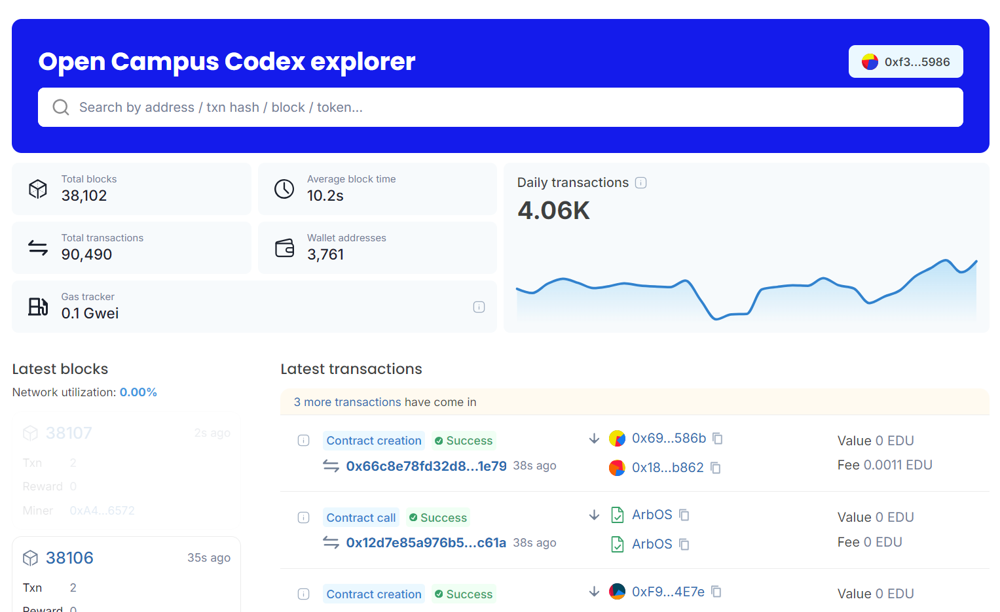

Here's the updated `README.md` file with the contract name changed to "Coffee":


```markdown
# Coffee Smart Contract

This is a simple Ethereum smart contract that allows users to buy "coffee" for the contract owner by sending Ether. The contract records a memo from the sender along with their name, message, and the timestamp of the transaction.

## Vision

The vision of this project is to create a decentralized way for creators, developers, and influencers to receive support and donations from their community in the form of cryptocurrency. By leveraging blockchain technology, this project ensures transparency, immutability, and ease of use for both the supporter and the recipient.

## Project Features

- **Buy Coffee:** Users can send Ether to the contract owner along with a personalized message.
- **Memo Storage:** Each transaction is stored on the blockchain as a memo, including the sender's name, message, timestamp, and address.
- **Transparency:** All memos are publicly accessible and can be retrieved by anyone using the `getMemos()` function.
- **Decentralized Support:** This project allows for decentralized monetary support, reducing the need for traditional financial intermediaries.

## Future Scope

- **Multi-Currency Support:** Allow users to donate using different ERC-20 tokens, not just Ether.
- **Memo Personalization:** Enable users to attach images or other types of media to their memos.
- **Rewards System:** Implement a rewards system where frequent supporters can receive exclusive content or benefits.
- **Analytics Dashboard:** Create a web-based dashboard for the contract owner to visualize and analyze the support they have received.
- **Integration with Web3 DApps:** Seamlessly integrate this contract into Web3 DApps for easier access and usage.

## Project Structure

- **coffee.sol:** The main smart contract that contains all the logic for receiving Ether and storing memos.
- **README.md:** Documentation of the project, providing details about its purpose, structure, and future plans.
- **Migrations (optional):** If you are using Truffle or a similar framework, migration scripts would be included here.

## Developer Details

- **Name:** [Your Name]
- **Email:** [Your Email]
- **LinkedIn:** [Your LinkedIn Profile]
- **GitHub:** [Your GitHub Profile]

Feel free to reach out for any questions or collaboration opportunities!

## Deployment
Chain Name: EduChain Open Campus
Contract Address: 0xc4df34914767107bf86926452c34ff60da49d04952fef07da076e027a634472f

## Developer Details
    **Name:** [Pranab Ray]
    **Email:** [b23169@students.iitmandi.ac.in]
    
## License

This project is licensed under the GPL-3.0 License.
```


